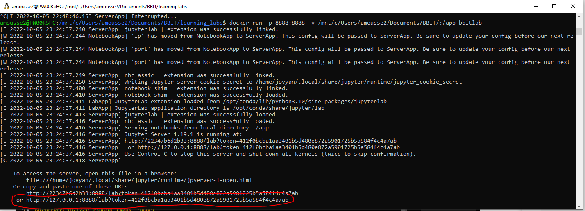
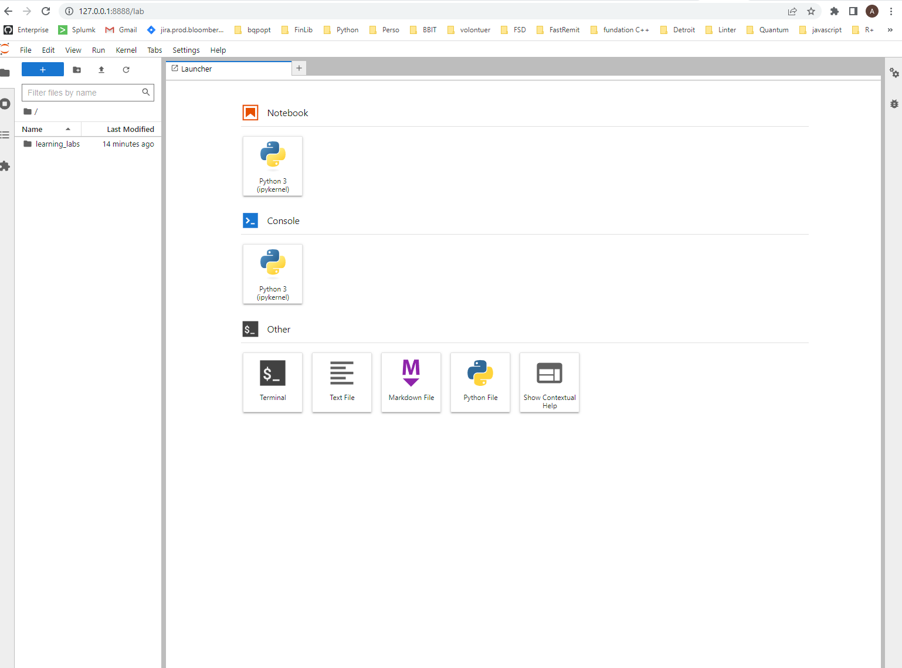

## Installation Instructions

### 1. Installing **Git** (Windows laptop only. Mac OS has Git already installed)
- Navigate to: https://www.atlassian.com/git/tutorials/git-bash
- Download & install the latest version of Git Bash.

### 2. Installing **Docker**
- Navigate to: https://docs.docker.com/engine/install/
- Download & install the right docker engine for your operating system.

### 3. Install your Favorite Terminal (You can skip this step if you already have one installed on your machine)
- You can install **Git Bash**, for example, https://git-scm.com/downloads.


### 4. Fork the GitHub repository and clone it locally.
- In your favorite terminal, clone the repository
    ```
    git clone <GitHubRepo>
    ```
- Navigate into the folder **learning_labs**

### 5. Create a **Docker image** of the BBIT Lab (This might take some time, so have a coffee :) )
- First, ensure that docker is running and then in your favorite terminal, from the folder **learning_labs**, run the following command to build the docker image:
    ```
    docker build . --tag bbitlab
    ``` 
**We can remove this step if we publish our image to DockerHub**

### 6. Launch a docker container layer over the docker image of the lab
- launch our container and mount the **learning_labs** folder as a volume to access the lab.
    ```
    docker run -p 8888:8888 -v <full path of the folder 'learning_labs'>:/app bbitlab
    ```

- When the container fully launches, you should have a similar output.
    You should copy the URL *(circled in red)* and paste it into your favorite web browser to launch Jupyter Lab.



**If you have a similar page displaying in your browser, you are all set and ready to start working on the BBIT Lab.**


Thank you!!