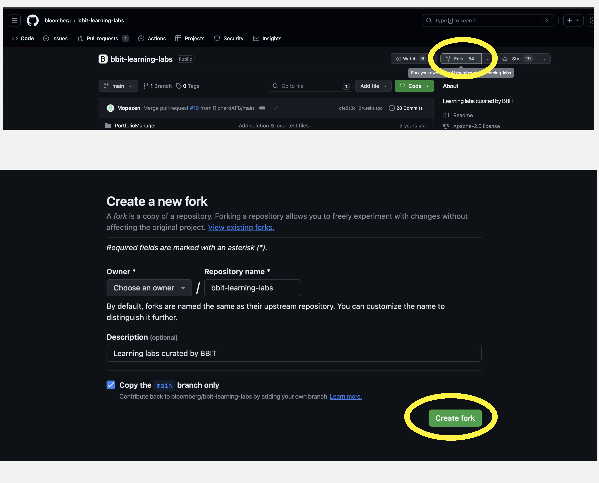
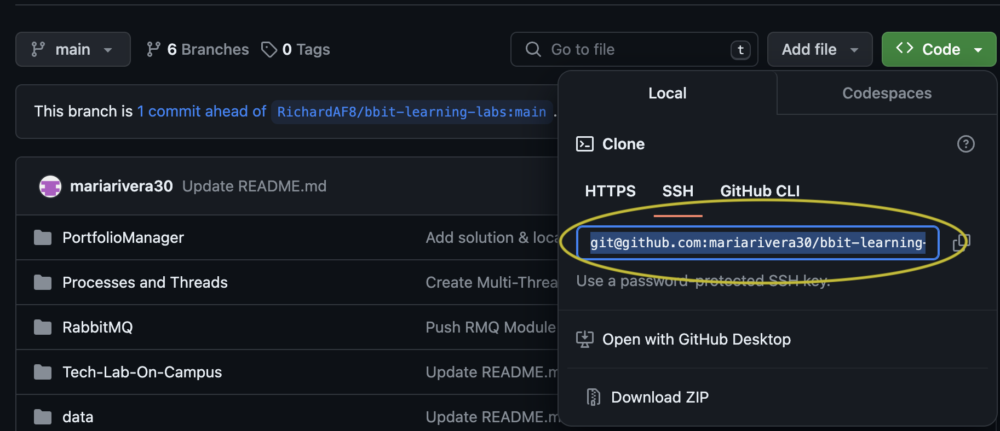

# Rabbit MQ On Campus Lab

## Background

The idea of this lab is to offer exposure to the RabbitMQ messaging framework, providing a basic understanding of the technology and the producer consumer relationship. During the lab you will apply your learning to create small system to setup information update on securities on interest. 

## Unit Ordering List

1. [Producer-AND-Consumer](./Producer-And-Consumer/README.md)
2. [Topic-Exchange](./Topic-Exchange/README.md)

## Key Learning Items

- Python CS Concepts
    - Classes & OOP
    - Importing & Exporting Modules
    - Inheritance 
- Rabbit MQ Concepts
    - Producers
    - Consumers
    - Exchanges
- Financial Concepts
    - Tickers
    - Industry Sectors
- Docker

## Setting Up Our Environment
For this project, we're going to leverage the use of Docker to create a helpful development environment for all of the engineers. [Docker](https://docs.docker.com/desktop/) is a tool used to integrate software dependencies and allow developers to quickly spin up software builds in portable lightweight containers which provide consistent environments, ensuring applications run the same way across various platforms. 

1. Fork the repo


2. Clone the forked repo into your working directory. Copy ssh. 


    ```sh
    git clone [SSH KEY]
    ```
NOTE: If you are using github for the first time and have not setup ssh key, refer to the documentation on [connecting to github with ssh](https://docs.github.com/en/authentication/connecting-to-github-with-ssh) and setup your ssh key before running the command `git clone`.


3. Navigate to the 'Tech-Lab-On-Campus' folder.
    ```sh
    cd bbit-learning-labs/Tech-Lab-On-Campus
    ```

4. Confirm that Docker and Docker Compose are working on your system.
    ```sh
    docker -v && docker-compose -v
    ```
* If this works correctly, you will have the versions of Docker and Docker Compose printed to the terminal.
* Note: If you encounter an error at this step navigate to advanced settings on your  Docker Desktop and ensure that `System (requires password)` is selected. This tab can be found by clicking on the gear icon in the top right corner.

5. Utilize Docker to generate and execute a functional image of the project directly from the terminal within your chosen Integrated Development Environment (IDE). 

There are two options to work on this project. Option [A] using an IDE, we recommend using VSCode. Option [B] using the jupyter notebook. Follow the steps outlined for the desired option to ensure a smooth setup and execution process:

* A) IDE  
    * In the terminal window of your IDE run:
        ```sh
        docker-compose up -d && docker-compose exec rmq_lab /bin/bash
        ```
        *  `docker-compose up -d` : Starts our rabbitmq and python service in detached mode (-d), running them in the background.
        * `docker-compose exec rmq_lab /bin/bash` : This command will open an interactive Bash shell inside the rmq_lab service container. Once you are inside the container you can run Python scripts.

        * Note: If you encounter an error such as `unix:///Users/userName/.docker/run/docker.sock. Is the docker daemon running?`, please ensure that your Docker application is running.

* B) Jupyter Notebook
    * In the terminal window of your IDE run:
        ```sh
        docker-compose up
        ```
    * In the output lines produced by the command, you will find three links providing access to the server hosting your Jupyter Notebook. Click on any one of these links to open and interact with the notebook. The links should resemble the following:
        ```
            rmq_lab-1   |     To access the server, open this file in a browser:
            rmq_lab-1   |         file:///home/jovyan/.local/share/jupyter/runtime/jpserver-1-open.html
            rmq_lab-1   |     Or copy and paste one of these URLs:
            rmq_lab-1   |         http://d572024fabe2:8888/lab?token=4a07fca9cd4a66eba129533a6272f5f5443fdf3f0b7c0e5e
            rmq_lab-1   |         http://127.0.0.1:8888/lab?token=4a07fca9cd4a66eba129533a6272f5f5443fdf3f0b7c0e5e
        ```
6. Here are the steps to check that the environment is running correctly:
    * Log Into the RabbitMQ Website.
        * From your desktop, open Docker Desktop Dashboard.
        * Find the Rabbitmq container and click on the URL under Port(s) for the U.I. This should open up the RabbitMQ website on your default browser.
        * Login username and password should be "guest"
    
    * Alternative:  Click on one of the generated URLs in your terminal, such as "http://localhost:15672/", once your docker container is up and running.
    
    * After setting up IDE you should have access to rabbit mq management. It will look like the following.
           
    * You are now ready to start the lab. Begin by navigating to the [Producer-AND-Consumer](./Producer-And-Consumer/README.md) folder and reading the "README.md" file. Each of the units will contain a readme file which will give you the necessary instructions to complete the lab and test your solution.


