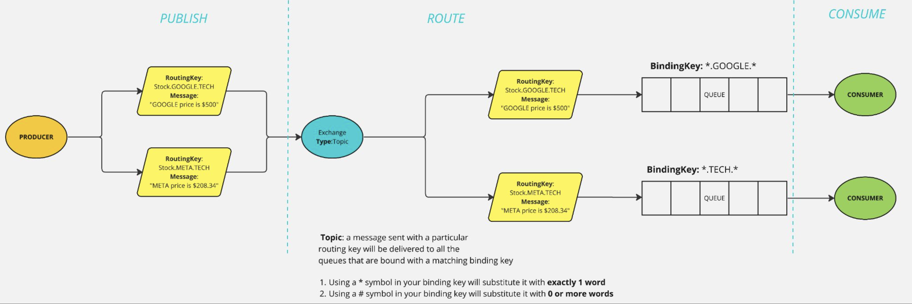

# Concepts

### What is Rabbit MQ?

RabbitMQ is a lightweight, language agnostic & open source messaging software that implements the [AMQP (Advanced Message Queuing Protocol)](https://www.amqp.org/about/what). It works as a message broker that supports various types of asynchronous messaging features and routing types. Using RabbitMQ you can configure your message to get from a source to destinations in a variety of ways.

Within this lab we'll focus on setting up a basic producer-consumer framework within rabbitMQ. This is just the beginning and there are many more ways rabbitMQ can be used! For more learning opportunities check out the official rabbitMQ [Getting Started](https://www.rabbitmq.com/getstarted.html) page.


### What is a Producer?

A producer is a entity (object, application, etc) that creates & sends information to be distributed. In RabbitMQ producers send these messages to an exchange. You can have multiple producers which depending on the exchange will send data to 0 to N queues. For this lab we'll focus on using a single producer. Producers send messages to exchanges along with the routing key associated with that message. At a high level this routing key tells the rabbitMQ framework that the producer would like to send the associated message to queues that match a given regex string. The replication & matching of the routing key is dependant on the type of exchange (explained below). A more concrete example is, we may have a message intended for a particular set of schools that are all in the US. My routing key in that scenario would be "US" which would signal this particular message should go to queues designated as US.

### What is a Consumer?

A consumer is an entity (object, application, etc.) receiving information from a queue. In RabbitMQ you can have multiple queues, each with the potential for various consumers. In this lab we'll focus on setting up a queue with a single consumer.

### Exchanges

Exchanges are the mechanism that tells RabbitMQ how messages should be directed to a queue. You can think of an exchange like different delivery services. Delivery service **Direct Delivery!** may deliver messages to queues/locations based on particular addresses "123 My Address Road, NY, NY, 10022". This would be an example of a **direct exchange** where messages are sent to queues that have a *binding key* that exactly matches the message's *routing key*. Other exchanges also exist such as the **fanout exchange** which will replicate incoming messages to all queues bound to the exchange. An excellent example of a fanout exchange would be a chat room where an incoming message is sent to all users within the chatroom. Typically, a producer needs to be made aware of the queues or consumers attached to queues. A producer is concerned with what exchange it wants to send its message to, the distribution method of that exchange, and the routing key of the message it wants to send.

Within Python using pika an exchange can be declared similar to the following:

```python
#Build our connection to the RMQ Connection.
#The AMPQ_URL is a string which tells pika the package the URL of our AMPQ service in this scenario RabbitMQ.
conParams = pika.URLParameters(os.environ['AMQP_URL'])
connection = pika.BlockingConnection(parameters=conParams)
channel = connection.channel()
channel.exchange_declare('Test Exchange')

#We can then publish data to that exchange using the basic_publish method
channel.basic_publish('Test Exchange', 'Test_route', 'Hi',...)
```

### Topic Exchange
A **topic exchange** route messages to one or many queues based on matching between a message routing key and the pattern that was used to bind a queue to an exchange.




Messages sent to a topic exchange must use a routing and binding key that are a list of words separated by dots (ex. `some.routing.key`). Topic exchanges are similar to **direct exchanges** in logic; a message sent with a particular routing key will be delivered to all the queues that are bound with a matching binding key.
- Using a `*` symbol in your binding key will substitute it with __exactly 1 word__
- Using a `#` symbol in your binding key will substitute it with __0 or more words__

With Python and pika, an exchange can be declared similar to the following:
```py
# We'll first set up the connection and channel
connection = pika.BlockingConnection(
    pika.ConnectionParameters(host='localhost'))
channel = connection.channel()

# Declare the topic exchange
channel.exchange_declare(exchange='topic_logs', exchange_type='topic')

# Set the routing key and publish a message with that topic exchange:
routing_key = sys.argv[1] if len(sys.argv) > 2 else 'anonymous.info'
message = ' '.join(sys.argv[2:]) or 'Hello World!'
channel.basic_publish(
    exchange='topic_logs', routing_key=routing_key, body=message)
print(f" [x] Sent {routing_key}:{message}")
```