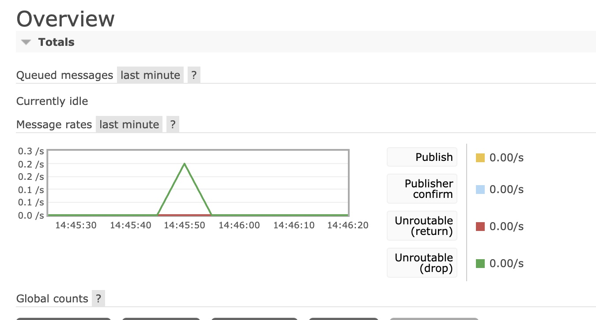

# Problem Definition: ✨Producer✨

##  Instructions
Create a ".py" file that will contain a class set up to be a producer in the RabbitMQ framework. This class will inherit from the mqProducerInterface and should publish a simple UTF-8 string message. 

Below are bullet points of the criteria:
- Your class should be named mqProducer.
- Your class should inherit from our mqProducerInterface.
- The class name should be `mqProducer` & the source file should be called `producer_sol.py`
- Constructor: Save the two variables needed to instantiate the class.
- Constructor: Call the setupRMQConnection function.
- setupRMQConnection Function: Establish connection to the RabbitMQ service.
- publishOrder:  Publish a simple UTF-8 string message from the parameter. 

###### [Note: Utilize the following resource to help instantiate the Producer Class: [RabbitMQ Toturial](https://www.rabbitmq.com/tutorials/tutorial-one-python.html)]

## Testing
To test your producer class, we'll use Docker to set up a container running RabbitMQ. We'll then create a testing container where you can run the test code provided. To validate the messages are being sent, you'll utilize the RabbitMQ container's management web application.
1. Log Into the RabbitMQ website.
* The login URL for the management web application will be http://localhost:15672/
* Login username and password should be "guest"
3. Send your message
* To test your implementation you can run `publish.py`. It will import your newly created class from the source file `producer_sol.py`
4. Check Message Rates
* Return to the RabbitMQ website.
* Look Under the Overview Tab for message rates to verify that a message was sent. Your message rate should look like the image below.

