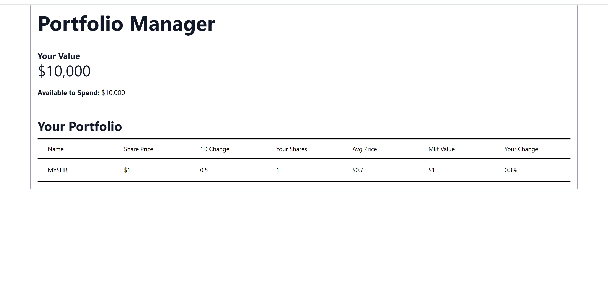

# Shares Learning Item
1. [What is a security?](#what-is-a-security)
2. [What is a share?](#what-is-a-share)
3. [Instructions](#instructions)
4. [Extended instructions](#extended-instructions)
5. [Solutions](#solutions)

## What is a security?
A security is an instrument or object that represents some sort of ownership or relationship of an entity which holds some monetary value. This may sound very ambiguous and that's because securities as a term are ambiguous. A security can be a stock like AAPL, shares that represent an ownership stake in a corporation, debt (such as a mortgage or corporate bond), or even new types of securities such as cryptocurrencies.

## What is a share?
A share is a specific type of security that denotes ownership in a public company. Owners of a corporation may choose to issue stock to raise capital. Companies divide their *stock* into *shares*, which are sold to investors.

## Instructions
We want to create a React component representation of a share. Share have names which are unique identifiers of what they represent, as well as a monetary value associated to them.

### React Component

A React component is an object representing an element displayed by the browser. JSX is a declarative syntax that mimics HTML, the markdown used by browsers, to express how these components are composed. You can define a React component in a separate file, and export it using the `export default` JavaScript keywords. Saving this file inside the `components` directory will allow you to import the component and render it inside any other component.

You will also notice that in the `pages` directory of a NextJS project, you always find the expression `export default function PageComponent() {...}`. Those are components as well, and become rendered when the user hits the page endpoint associated with that component, denoted by the filename that contains said component.

An example of a complete React component goes as follows:
```jsx
export default function MyComponent() {
    return <p>Hello world!</p>
}
```

The above template only returns one HTML element. What if you wanted to return more? React does not allow to return multiple HTML elements at a time. The proposed solution to this is to return one container element that has all other elements you'd like to render (usually a `<div></div>` element or an empty tag `<></>`). This way, you can do things like:

```jsx
export default function MyComponent() {
    return (
        <div>
            <h1>My Page Title</h1>
            <p>Hello world!</p>
        </div>
    )
}
```
* Hint: for styling purposes, you can wrap HTML elements with parentheses

For this lab, you will be creating a component called `Share`. Your component function should return an empty tag (`<></>`) of 7 `div` elements all with the value of the `className` attribute set to `border-y border-black px-6 py-4`. These `div` elements correspond to the following values of a share, for our purposes:
1. Share symbol,
2. Share price,
3. 1 day percent change,
4. Amount of shares owned,
5. Average share price,
6. Market value,
7. Your change

For context, the `className` attribute allows you to modify the HTML `class` attribute. These two are not exactly the same. `className` is used in the context of JSX, while `class` is used in the context of HTML/CSS. Given that JavaScript already has a keyword `class` reserved, for creating classes in Object-Oriented Programming in JavaScript, then it is discouraged to also use this same keyword for modifying the `class` HTML attribute. Hence, `className` was created to address this concern.

For each `div` element, we are going to add some dummy data to represent information about a share, although later this information would come from the backend. For now, add the following text values inside each of the `div` elements you create, respectively:
1. Share symbol: `MYSHRE`
2. Share price: `1`
3. 1 day percent change: `0.5`
4. Amount of shares owned: `1`
5. Average share price: `0.7`
6. Market value: `1`
7. Your change: `0.3`

Save your changes in a file name `Share.jsx`, inside the `components` directory. Afterwards, import your component inside the `index.jsx` file. Finally, create a component tag (e.g. `<Share />` or `<Share><Share/>`) and add it inside the `div` element of the `index.jsx` file that has a `className` value of `contents`.
* Remember to use your component in the index file you need to import the component first. For the module loader we're using you can import your component using the following statement
```jsx
import <my_component> from "@/components/<my_component_source>
```
* Remember that in order to use a JavaScript expression inside a JSX statement, you would need to escape it with curly braces \{ \}

## Extended Instructions
If you have more experience with software development, follow these instructions to make it for a more challenging task.

Find the `index.jsx` file, and delete its contents. You will work with a clean state. You should use knowledge of HTML, CSS, JavaScript, TailwindCSS and React in order to build the skeleton of the table that will eventually display all the shares owned by the user.

You will create a component named `Home`. This component should return a JSX expression that renders the table described above. We haven't covered React hooks yet, so for now, you will need to write the following code inside the function body of your `Home` component:
```jsx
const [hardCodedPortfolioValue, setHardCodedPortfolioValue] = useState(10_000);
const [hardCodedUserAmount, setHardCodedUserAmount] = useState(10_000);
```
* Make sure to import the `useState` hook from the React library

At some point, you will have to render the `hardCodedPortfolioValue` and `hardCodedUserAmount` variables using the `toLocaleString`. You render JavaScript variables in a JSX expression using curly braces (\{ \}).

You will have to use some CSS and TailwindCSS in order to make your code look like the solution provided. Here are some of the TailwindCSS classes used in the solution:
* `mx-auto`: centers a container
* `max-w-screen-xl`: gives the receiving element a maximum width matching the `screen-xl` breakpoint
* `p-4`: provides padding of 1rem on all sides (top, bottom, left, right)
* `border`: adds a border
* `border-slate-400`: `slate` specifies border color (can be any other color), `400` specifies color opacity (can be changed)
* `rounded-sm`: rounds a border with value `sm` (small)
* `text-5xl`: specifies font size
* `font-bold`: makes a font bold
* `text-gray-900`: specifies color and color opacity of text
* `mb-10`: adds a margin to the bottom of 2.5rem
* `text-base`: sets font size
* `overflow-x-auto`: adds horizontal scrolling if needed
* `border-collapse`: makes borders of a table collapse
* `text-left`: aligns text to the left
* `rtl:text-right`: conditionally adds `text-right` style in a *right to left* order (important for the table!)
* `grid`: turns an element into a grid (important for the table!)
* `grid-cols-7`: defines 7 columns on an element with the `grid` style (important for the table!)
* `grid-rows-1`: defines 1 row on an element with the `grid` style (important for the table!)
* `bg-black`: defines a background color of black

Additionally, you need to add the `contents` CSS class to whatever container elements you choose to hold the header columns and the data rows of the table, as this class is referenced in later tasks.

Afterwards, you need to follow the [instructions](#instructions) section to implement a `Share` component.

In general, TailwindCSS classes follow a general format: `{property}-{modifier}-{value}`, more or less, so the list above is not exhaustive of all the classes used (but does contain the general format used for the solution to this task).

Knowledge of HTML, CSS, and TailwindCSS is vital for these instructions. Consult the official documentations if you feel stuck or need more information:
* https://www.w3schools.com/tags/default.asp
* https://tailwindcss.com/docs/utility-first
* https://react.dev/

## Solutions
This is how your work should look like after completing this task:



You can also take a look at the `Solution` directory for reference.
