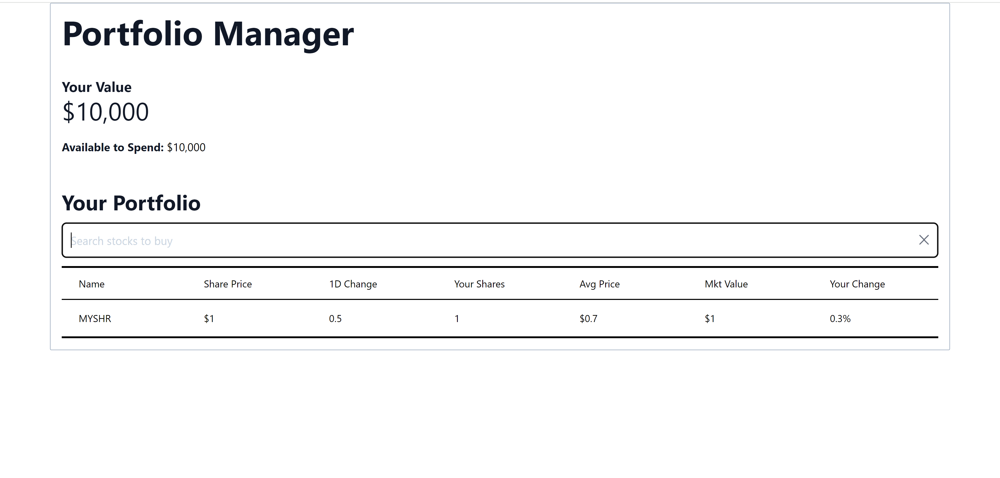

# Creating a Shares Search Bar Component

You have created a Share component and rendered it on your portfolio table with static data. What if you wanted to add more shares to your portfolio?

An app with functionality like the one we're working on here would benefit greatly from having a way to search all potentially available shares.

## Instructions

You are going to complete an implementation of a component that will serve as a search bar for market shares. A search bar like the one described above requires functionality on both the *frontend* and *backend* portions of the app. For the purposes of this lab, we are going to focus mostly on the frontend portion of the search bar component.

A React component can be thought of as a collection of HTML code, that can be encapsulated, repurposed, and reused in multiple places across a web application. If we want to think of how the body of a search bar component would look like, the following example structure would be a good start:
```html
<div>
    <input '...'>...</input>
    .
    .
    .
</div>
```

The `input` HTML element is an object that allows interaction between the user and a part of a website. Using the `type` HTML attribute, one can change the type of the input (e.g. a button, a text field, etc.).

You are going to make your changes in the `your-nextjs-app/src/components/SearchBar.jsx` file. There is going to be some existing code, to simplify the process. Make sure you add the following, under where it says *Work here*:
1. A new `input` element, as well as
2. The `SearchBarCloseButton` component that we provide for you in the `your-nextjs-app/src/components` directory (don't forget to import it!)

Additionally, you are going to modify the `your-nextjs-app/src/pages/index.jsx` to include the `SearchBar` component and render it inside the page. You should insert the component after the `h3` heading with the text "Your portfolio".

If you follow the steps above, you will end up with a search bar component alright, but neither will it be very functional nor will it be correctly styled. In order to address that, define the following properties for the `input` element that you just created:
1. Define a placeholder text, "Search stocks to buy" by defining the `placeholder` attribute of the `input` element
2. Set the `className` attribute of the `input` element to the following value: `border border-slate-300 rounded-md w-full hover: placeholder:text-slate-300 p-3 mb-3`
    * This adds handy Tailwind CSS classes in order to improve the appearance and functionality of the search bar

You will notice that the clear button of the input field doesn't quite work yet. In the next assignment, we are going to address that with the use of *props*.

## Resources
* https://www.w3schools.com/tags/default.asp
* https://tailwindcss.com/docs/utility-first
* https://react.dev/

## Solutions
This is how your work should look like after completing this task:



You can also take a look at the `Solution` directory for reference.
