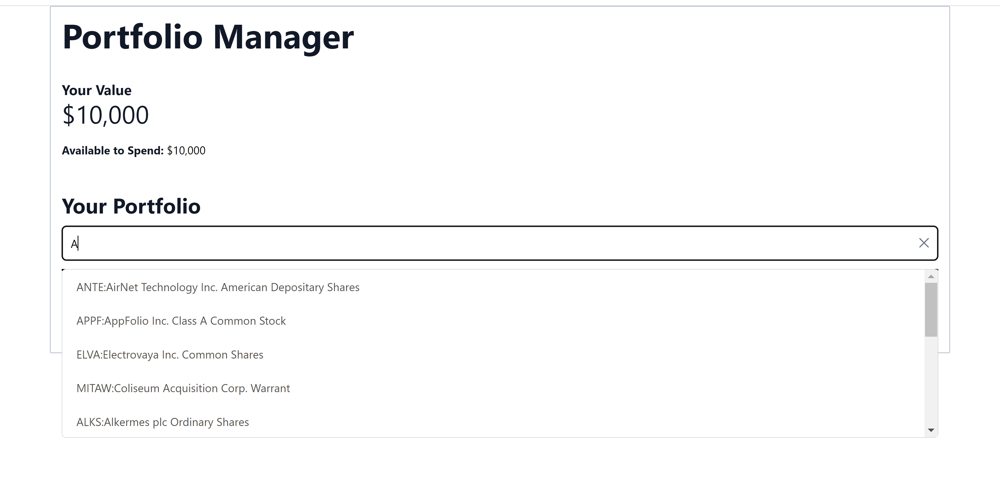

# Events, Event Handlers and Hooks
1. [Event handlers](#event-handlers)
2. [React Hooks](#react-hooks)
3. [Instructions](#instructions)
4. [Props](#props)
5. [Extended instructions](#extended-instructions)
6. [Solutions](#solutions)

By now you have a basic table that contains a fixed share that you created using a share component, as well as a search bar. The search bar, however, isn't very functional at the moment. We can fix that by defining event handlers, that respond to events, as well as hooks, in order to make the search bar, and the website as a whole, more functional and dynamic.

## Event Handlers

An event handler is a function that responds to an event in a running program. In a webpage, an event handler will commonly respond to user input.

## React Hooks

A React hook is a more specific type of function. By convention, React hook names start with the prefix `use`. They are more restrictive than regular functions like event handlers (the latter which are usually regular JavaScript functions). For example, they can only be called at the top of your components (or other hooks). Using hooks in React, which by nature is a functional approach to programming, one can achieve a lot of the benefits of an Object-Oriented programming approach to website creation, such as mutable states or the sharing of data across different parts of the code, with few or none of the drawbacks of said approach (such as complex state diagrams, impure functions, etc.).

Additionally, hooks allows us to alter different parts of the web UI dynamically, and even communicate with the backend, should the data needed to be display come from a source outside of the website.

React-provided hooks are imported from the `react` library.

## Instructions

You are going to be modifying the following files:
* `your-nextjs-app/src/pages/index.jsx`
* `your-nextjs-app/src/components/SearchBar.jsx`
* `your-nextjs-app/src/components/SearchBarCloseButton.jsx`

If you are following the extended instructions, go to the [extended instructions section](#extended-instructions).

In order to simplify the process and maintain focus on the frontend portion of this app, we are going to provide some starting code.

Inside the `Home` component in the `index.jsx` page, and before the `return` statement, insert the following code:
```jsx
// Create an object to store the shares of a user, as well as a hook to modify its value
const [shares, setShares] = useState([]);
// Create a way of keeping track if data from the backend is still loading
const [isLoading, setLoading] = useState(true);
// Create an object to store the selected share, as well as a hook to modify it
const [selectedShare, setSelectedShare] = useState(null);

// Create a flag for whether to reveal a share buy window
const [revealBuyWindow, setRevealBuyWindow] = useState(false);

async function updateSelectedShare(shareSymbol, shareName) {
    if (!shareSymbol) {
        return;
    }

    // Make call to backend to retrieve share information
    fetch(`http://localhost/wp-json/techlabs/v1/get_share_price/${shareSymbol}`)
        .then(res => res.json())
        .then(data => {
            const sharePrice = data;
            setSelectedShare({ symbol: shareSymbol, name: shareName, sharePrice });
        });
}

function resetSelectedShare() {
    setSelectedShare(null);
}

function handleOpenSelectedShareWindow() {
    setRevealBuyWindow(true);
}

function updatePortfolioValue({ shareAmount, newPortfolioValue }) {
    setHardCodedPortfolioValue(newPortfolioValue);
}

// Load all shares owned by current user
useEffect(() => {
fetch(`${process.env.NEXT_PUBLIC_API_URL}/get_shares`)
    .then((res) => res.json())
    .then((data) => {
        const _shares = data;
        setShares(_shares);
        setLoading(false);
    })
    .catch(error => {
        console.log(error);
    });
});
```
* Make sure to import the `useEffect` hook from the `react` library

### Props

Now that you have defined some event handlers and hooks in the `Home` component, some of the other components could benefit from this new functionality. Information that you pass down to a component is known as a prop. You can pass all kinds of JavaScript variables as props, even functions (thanks to them being first-world objects in JavaScript).

Notice that, when writing down the code above, you created the `updateSelectedShare` and the `resetSelectedShare` functions. These functions modify HTML elements from the `Home` page component, but should mainly be triggered when interacting with the search bar; if a user clicks on a searched share, the selected share should be updated. Analogously, if the user clicks on the clear button of the search bar, the selected share should be promptly reset.
* This is a good example of when you need to use props: when you need to pass data from one component to another component

A common convention of defining props in a component is to create destructured function parameters like so:
```jsx
export default function MyComponent({ param1, param2 }) {
    return <p>Parameter 1 value:{param1}, parameter 2 value: {param2}</p>
}
```
* This function syntax creates an anonymous object that contains the desired parameters. The values (of the keys) of this anonymous object become immediately destructured and available in the function's scope

One great advantage of defining props in this fashion, is that in order to pass arguments to a prop, you have to supply the parameter name along with its value, i.e. *named parameters*. Order is not significant when done in this way. All this aids in code extensibility and readability.

An example of passing a prop as an argument to a component would look like:
```jsx
export default function Home() {
    /* ... */
    const myParam1 = "abc";
    const myParam2 = 123;
    return (
        <body>
            <MyComponent param1={myParam1} param2={myParam2}></MyComponent>
        </body>
    );
}
```
* We use JSX expression notation to reference JavaScript expressions (such as variables) inside HTML elements, with the use of curly braces \{ \}

#### Calling React Hooks

In the `index.jsx`, you called the `SearchBar` without any props being passed. Now, you will need to pass the `updateSelectedShare`, `resetSelectedShare` and `setEnableShareDropdown` functions as props to the component. Make sure to also define the `updateSelectedShare` and `resetSelectedShare` functions as props in the `SearchBar.jsx`.

After this, pass all 3 functions mentioned above as props to the `SearchBarCloseButton` component, and make sure to define these functions as props in the `SearchBarCloseButton` component definition.
* In order to make the clear button fully functional, remove the `disabled={true}` expression from the `button` element

Additionally, for the `input` element of your `SearchBar` component, do the following changes:
1. Set the `value` attribute to:
```jsx
stockFieldValue
```
2. Set the `onInput` attribute to:
```jsx
(event) => { onShareFieldInput(event); resetSelectedShare() }
```
* This adds interactive functionality to the search bar
3. Set the `onChange` attribute to:
```jsx
event => updateShareFieldValue(event.target.value)
```
* Adding this will allow the current value of the input field be compared to the matching patterns of available share symbols, and eventually, display the matching shares
4. Set the `onFocus` attribute to:
```jsx
() => setEnableShareDropdown(true)
```
* This makes it so, when someone starts typing in the search bar, a suggestions window pops up with suggested shares, based on the current input string

## Extended Instructions
If you have more experience with software development, follow these instructions to make it for a more challenging task.

In the `index.jsx`, inside the body of the `Home` component, do the following:
1. Define a React `useState` hook with variable name `shares` and auxiliary function `setShares`. Set the initial state of the variable to an empty array
    * The general syntax for defining a React `useState` hook is the following:
        ```jsx
            const [variableName, setVariableName] = useState("initial variable value");
        ```
2. Define a React `useState` hook with variable name `isLoading` and its corresponding auxiliary function. Set its initial state to `true`
3. Define a React `useState` hook with variable name `selectedShare` and its corresponding auxiliary function. Set its initial state to `null`
4. Define a React `useState` hook with variable name `revealBuyWindow` and its corresponding auxiliary function. Set its initial state to `false`
5. Define an `async` function called `updateSelectedShare` that, given a share symbol and share name as parameters, does the following:
    * If the share symbol is not defined or null, do not continue function execution
    * Else, make a `fetch` call to the API endpoint `http://localhost/wp-json/techlabs/v1/get_share_price/${shareSymbol}`, where `shareSymbol` is the parameter name for the share symbol. Unpack the response using the `.json()` method
    * The result of using the `json()` method will be the share price for the given share
    * Save this value into a variable and call the `setSelectedShare` auxiliary function. The argument you should pass to this function is a JavaScript object of the following structure:
        ```
            {
                "symbol": <share symbol>,
                "name": <share name>,
                "sharePrice": <share price>
            }
        ```
        * where the values are the respective parameters of the original function, and the share price value is the one you just extracted
    * For more information about using the `fetch` function, you can consult the MDN Web Documentation: https://developer.mozilla.org/en-US/docs/Web/API/Fetch_API/Using_Fetch
6. Define the function `resetSelectedShare`, that calls `setSelectedShare` with a value of `null`
7. Define the function `handleOpenSelectedShareWindow`, that calls `setRevealBuyWindow` with a value of `true`
8. Define a function `updatePortfoliovalue`, with an object parameter that has keys `shareAmount` and `newPortfolioValue`, that calls `setHardCodedPortfolioValue` and passes `newPortfolioValue` as an argument
9. Write the following code before the `return` statement:
    ```jsx
    // Load all shares owned by current user
    useEffect(() => {
    fetch(`${process.env.NEXT_PUBLIC_API_URL}/get_shares`)
        .then((res) => res.json())
        .then((data) => {
            const _shares = data;
            setShares(_shares);
            setLoading(false);
        })
        .catch(error => {
            console.log(error);
        });
    });
    ```

After accomplishing the above, continue from the [this section](#calling-react-hooks).

Refer to the [props](#props) section for any questions regarding React props.

## Solutions
This is how your work should look like after completing this task:



You can also take a look at the `Solution` directory for reference.

