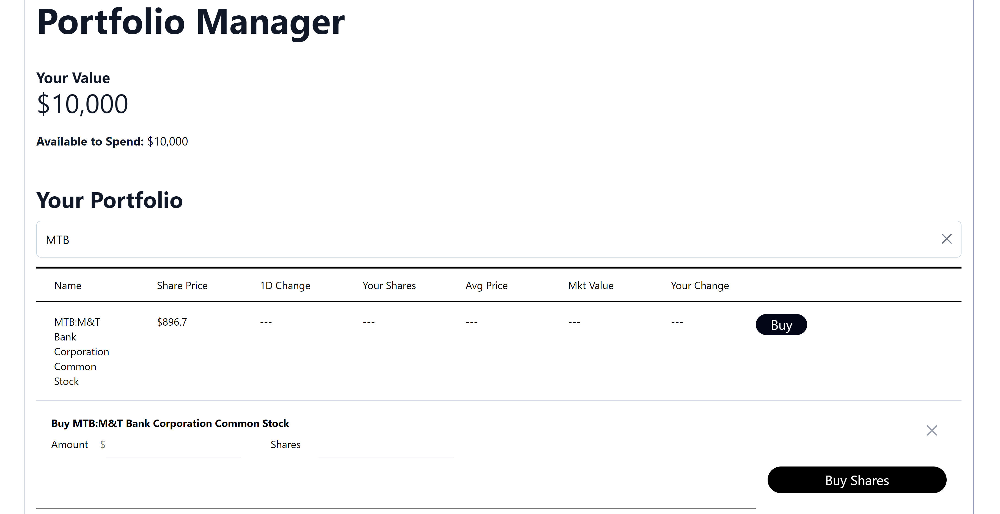

# Buy Share Functionality
1. [Instructions](#instructions)
2. [Extended Instructions](#extended-instructions)
3. [Solutions](#solutions)

## Instructions

If you are following the extended instructions, go to the [extended instructions section](#extended-instructions).

### Dynamic CSS Rows

We are going to use some of the knowledge learned in the previous lab, in order to implement functionality in our app to buy and sell shares.

In the `your-nextjs-app/src/pages/index.jsx` file, you will find a `div` element that has a Tailwind CSS class of `grid-cols-7`. You are going to substitute the "7" for a "9"; this will result in allocating two new extra columns on the shares table (for the "Buy" and "Sell" buttons, eventually).

In the same `div` element we have `grid-rows-1` in the CSS class, which only allocates one row on the table, currently holding our static share. We want to vary the amount of rows allocated on the table depending on the amount of shares that we have purchased. Replace the `grid-rows-1` CSS class with a JavaScript expression that results in the following:
* If the length of the `shares` array is greater than 1, yield the string `grid-rows-n`, where *n* is equal to the length of the `shares` array plus one
* Else, yield the empty string
* We provided the `shares` array object in the previous lab, and it itself will be populated with any purchased shares from the backend without any further work
* Make sure to check that the `shares` array is defined before treating it as a JavaScript array. `shares` is defined using the `useState` React hook, with an initial state of an empty array. However, React hook states are queued asynchronously; by the time you check for the length of `shares`, it could be the case that it isn't defined (yet)

The attribute where you can find the CSS classes in the `div` element mentioned above is already in JavaScript expression syntax, and using backticks (\`\`). You can use a JavaScript expression inside backticks by opening it with `${...}`.

### Select a Share

Next, write the following code inside the `div` element with the `className` attribute set to `contents`:
```jsx
{ (!selectedShare) ? '' : <SelectedShareWindow selectedShare={selectedShare} handleOpenSelectedShareWindow={handleOpenSelectedShareWindow} /> }
{ (!revealBuyWindow || !selectedShare) ? '' : <BuyWindow selectedShare={selectedShare} hardCodedUserAmount={hardCodedUserAmount} setHardCodedUserAmount={setHardCodedUserAmount} portfolioValue={hardCodedPortfolioValue} updatePortfolioValue={updatePortfolioValue} handleCloseWindow={() => setRevealBuyWindow(false)} /> }
```
* This will show a window when the user clicks on a suggested stock, with the option to buy shares from said stock
* The above code should be the first child element of the `div` container
* Make sure to import the `SelectedShareWindow` and the `BuyWindow` components, that we provide for you, into the file

Additionally, insert the `col-span-3` CSS class the `div` element that has the child text "Your change".

## Extended Instructions

If you have more experience with software development, follow these instructions to make it for a more challenging task.

Follow instructions for the [Dynamic CSS Rows](#dynamic-css-rows) section. Then, continue here.

Find the `div` element with the CSS class of `contents`. Inside this `div`, do the following:
1. Write a JSX expression that, if the variable `selectedShare` is [falsy](https://developer.mozilla.org/en-US/docs/Glossary/Falsy), returns the empty string, else returns a `SelectedShareWindow` component. This component takes as parameters a `selectedShare` and the `handleOpenShareWindow` function, make sure to pass these
2. Write a JSX expression that, if the variable `revealBuyWindow` is falsy, or if the `selectedShare` variable is falsy as well, returns the empty string. Else, it returns a `BuyWindow` component (we provide for you). This component takes as parameters the `selectedShare`, the `hardCodedUserAmount`, the `setHardCodedUserAmount`, the `portfolioValue`, the `updatePortfolioValue`, and the `handleCloseWindow` variables. All of these should be defined (except `handleCloseWindow`), so make sure to pass them as props to this component
    * For `handleCloseWindow`, pass in a JavaScript anonymous function that takes zero arguments and calls `setRevealBuyWindow` with a value of `false`

## Solutions
This is how your work should look like after completing this task:



You can also take a look at the `Solution` directory for reference.
