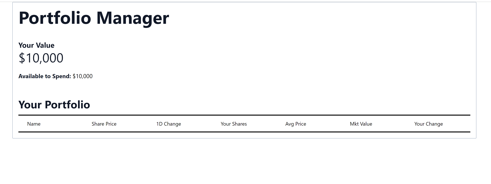

# Learning Labs

Get ready to learn! Bloomberg learning labs are a collection of activities designed to help candidates learn more about particular technologies, financial domain concepts and display how we can use computer science knowledge to solve problems in this domain.

## Menu

- [Getting Started](#getting-started)
- [Rationale](#rationale)
- [Framework](#Framework)
- [Contributions](#contributions)
- [License](#license)
- [Code of Conduct](#code-of-conduct)
- [Security Vulnerability Reporting](#security-vulnerability-reporting)
- [Learn More](#learn-more)
- [Deploy on Vercel](#deploy-on-vercel)

## Rationale

Here at Bloomberg, we wanted to give individual a better insight into what software engineering looks like and how we build our software solutions. This repo contains a series of labs which will walk through & engage developers to create solutions to problems we face at Bloomberg! Through these labs you can learn more about our problem domain and continue to develop your coding skills.

## Framework

This lab follows a framework of learning items. Each learning item should have a goal/objective for the developer to complete. Objective items can build off each other allowing the developer to use their previous code in new problem sets. Each learning item item has set of **developer provided solutions**

## Contributions

We :heart: contributions.

Have you had a good experience with this project? Why not share some love and contribute code, or just let us know about any issues you had with it?

We welcome issue reports [here](../../issues); be sure to choose the proper issue template for your issue, so that we can be sure you're providing the necessary information.

Before sending a [Pull Request](../../pulls), please make sure you read our
[Contribution Guidelines](https://github.com/bloomberg/.github/blob/master/CONTRIBUTING.md).

## License

Please read the [LICENSE](LICENSE) file.

## Code of Conduct

This project has adopted a [Code of Conduct](https://github.com/bloomberg/.github/blob/master/CODE_OF_CONDUCT.md).
If you have any concerns about the Code, or behavior which you have experienced in the project, please
contact us at opensource@bloomberg.net.

## Security Vulnerability Reporting

If you believe you have identified a security vulnerability in this project, please send email to the project
team at opensource@bloomberg.net, detailing the suspected issue and any methods you've found to reproduce it.

Please do NOT open an issue in the GitHub repository, as we'd prefer to keep vulnerability reports private until
we've had an opportunity to review and address them.

## Getting Started

The `your-nextjs-app` will be your main working directory. In order to run your webapp, follow the instructions below.

Open [http://localhost:3000](http://localhost:3000) with your browser to see the result.

### Technical Requirements
- Docker
- Git

### Installing Git

In order to easily download the most up-to-date version of this repository, you will be interested in downloading [Git](https://git-scm.com/downloads). Once you have downloaded and installed Git, you should be able to clone this repository.

Once you have installed Git, clone this repository by opening a terminal window and running:
```
git clone https://github.com/bloomberg/bbit-learning-labs
```

The `bbit-learning-labs` repository is the parent directory of this tech lab. Your work will be contained within the `bbit-learning-labs/WebDevelopment` directory. Navigate to this directory by running the command `cd bbit-learning-labs/`, in a terminal window.

### Installing Docker

Docker Compose is a tool for defining and running multi-container applications. It is the key to unlocking a streamlined and efficient development and deployment experience.

1. [Install Docker](https://docs.docker.com/get-docker/) by following instructions for your Operating System.

2. Then, build and run your application containers from this directory by running the command `docker compose up`:
    * The `docker compose up` command will execute the following commands (`npm install` && `npm run dev`, defined in the `docker-compose.yml` file) that will start your web application in addition to running a local backend server for your webapp API requests.

3. Your web application should be running. Feel free to open `your-nextjs-app` directory in the text editor/IDE of your choice, where you will begin creating files for your project.

4. Open [http://localhost:3001](http://localhost:3001) with your browser to see the UI of your web application. This is the completed version of the application which you will achieve!

This is an example of how the website should look like after a successful setup:

